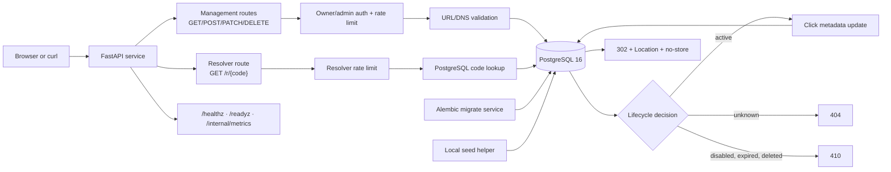
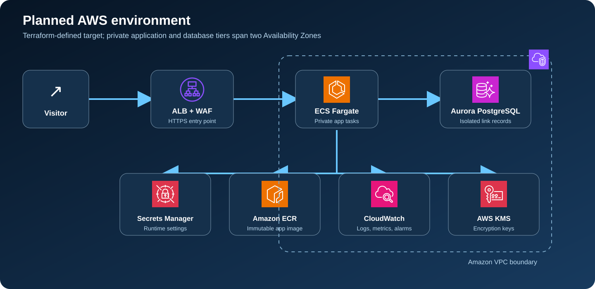
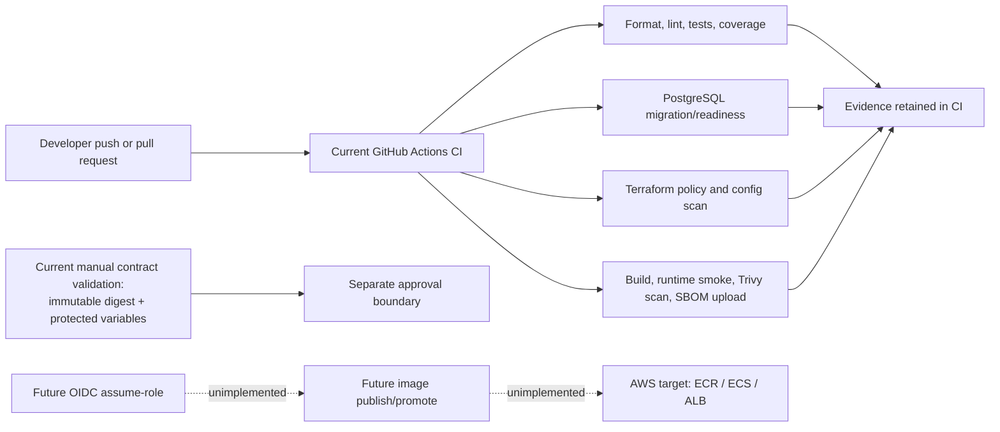

<!-- reader-first-readme:v1 -->

# Secure URL Shortener Platform

This service turns a long web address into a short, memorable link while giving
its owner control over when that link works. It is useful for teams that need
simple redirects without allowing the service to browse private networks,
expose management actions publicly, or quietly reuse deleted codes.

The complete product runs locally with PostgreSQL. The repository also defines
an independent AWS environment that an operator can deploy in their own
account; that cloud design has been validated as code but not run on AWS.

## The 30-second overview

1. An authorized owner submits a normal `http` or `https` destination.
2. The service checks that the address is public and safe to store.
3. It returns a short code such as `docs-1`.
4. A visitor opens `/r/docs-1` and receives a standard web redirect.
5. The owner can later expire, pause, restore, or permanently retire the link.
6. Health, readiness, metrics, and structured logs help an operator understand
   whether the service is working.

## What the service does

An authorized owner creates a short code for a validated HTTP(S) destination.
Anyone with the code can resolve it through a `302` redirect. Owners and
administrators can inspect, disable, re-enable, expire, or tombstone links.
The service never fetches the destination server-side.

The lifecycle is deliberate: unknown codes return `404`; disabled, expired,
and deleted codes return `410`; deleted codes remain tombstoned and can never
be reused. Click count and last-access time are recorded without storing client
IP addresses or user agents.

## A representative user journey

Suppose a documentation team wants a short link for a release guide. An owner
submits the guide's public address using a management token. The service
resolves the address before saving it and rejects destinations that point to a
private machine, cloud metadata endpoint, or other non-public network. It
stores the approved destination and returns the requested code.

A reader can then open that code without signing in. The service looks up its
state, records only a click count and time, and returns the destination to the
reader's browser. It never downloads the destination itself. If the owner later
disables, expires, or deletes the link, visitors receive `410 Gone`; deletion
leaves a permanent marker so the same code cannot be reassigned unexpectedly.

## Implemented capabilities

- FastAPI application with server-rendered accessible HTML creation form.
- PostgreSQL 16 persistence through SQLAlchemy async and Alembic.
- Optional custom aliases, cryptographically random aliases, expiry, disable,
  tombstone deletion, ownership, and administrator management.
- HTTP/HTTPS-only destination validation, 2,048-character URL limit, DNS
  resolution, and rejection of private, loopback, link-local, unspecified,
  metadata, and other non-global addresses.
- Constant-time bearer-token checks, owner scoping, request IDs, structured
  JSON logs with destination/credential redaction, and safe error envelopes.
- Local bounded rate limiting with `Retry-After`; the UI additionally uses
  same-origin `Origin` validation and separate creation/failed-auth buckets.
- `/healthz`, `/readyz`, authenticated `/internal/metrics`, and a non-root,
  read-only-capable container.

## System architecture and flows



Create flow: the API authenticates the caller, validates the destination and
optional alias, writes the link, and returns `201` with a `Location` header.
Resolve flow: the API looks up the code, applies lifecycle rules, increments
safe click metadata, and returns `302` without contacting the destination.

In plain language, management requests pass through identity, rate-limit, and
destination-safety checks before PostgreSQL stores a link. Public visitors use
only the resolver path, which reads lifecycle state and either redirects or
returns a safe `404`/`410` response.

## Running the project locally: exact deployment method

Prerequisites: Docker Desktop and Python 3.13 or newer.

```sh
python3 -m venv .venv
source .venv/bin/activate
python -m pip install --requirement requirements.lock
python -m pip install --no-deps --editable .
docker compose up --build -d
curl --fail http://localhost:8000/healthz
curl --fail http://localhost:8000/readyz
```

Compose starts PostgreSQL, runs the separate Alembic `migrate` service, then
starts the application. The images and database use pinned, disposable local
fixtures. They must not be reused in shared or cloud environments.

Useful commands:

```sh
docker compose logs -f app
docker compose exec -T app python scripts/seed.py
python -m pytest -q
coverage run -m pytest -q
coverage report --show-missing --fail-under=75
docker compose down
```

The seed helper creates deterministic example codes; reset the disposable
database before running it again to avoid uniqueness collisions.

For a destructive disposable database reset, use
[docs/operations/reset.md](docs/operations/reset.md). The local start and
recovery procedures are in [docs/operations/local-start.md](docs/operations/local-start.md),
[docs/operations/backup-restore.md](docs/operations/backup-restore.md), and
[docs/operations/rollback.md](docs/operations/rollback.md).

## API at a glance

The canonical contract is [docs/api/openapi.yaml](docs/api/openapi.yaml).
Management routes require an owner or administrator bearer identity; the
public resolver and health endpoints do not.

| Method | Route | Auth | Success and lifecycle semantics |
|---|---|---|---|
| `GET` | `/healthz` | None | `200` liveness |
| `GET` | `/readyz` | None | `200` when PostgreSQL is ready; `503` otherwise |
| `POST` | `/v1/links` | Owner/admin | `201`, JSON body, `Location: /r/{code}` |
| `GET` | `/v1/links/{code}` | Owner/admin | `200`; `404` unknown; `410` inactive |
| `PATCH` | `/v1/links/{code}` | Owner/admin | `200`; `409` invalid transition; `410` expired/deleted |
| `DELETE` | `/v1/links/{code}` | Owner/admin | `204`; tombstone, no code reuse |
| `GET` | `/r/{code}` | None | `302` with `Location` and `Cache-Control: no-store` |
| `GET` | `/internal/metrics` | Owner/admin | `200` plain-text process counters |

The local demonstration UI serves `GET /` and posts to `/ui/links`; it uses
the same owner token but is separate from the canonical JSON API.

Example API use with the disposable Compose fixture (local development only):

```sh
export OWNER_TOKEN=local-owner-token
curl --fail -X POST http://localhost:8000/v1/links \
  -H "authorization: Bearer ${OWNER_TOKEN}" \
  -H 'content-type: application/json' \
  -d '{"destination":"https://example.com/docs","code":"docs-1"}'
curl --include --max-redirs 0 http://localhost:8000/r/docs-1
curl --fail http://localhost:8000/v1/links/docs-1 \
  -H "authorization: Bearer ${OWNER_TOKEN}"
```

The Compose fixture maps `owner-demo` to `local-owner-token` and `admin` to a
separate local administrator fixture. These values are for disposable local
development only. Configuration names and environment boundaries are described
in [docs/security.md](docs/security.md).

## AWS cloud resources

Terraform describes an independently deployable environment. The request
path is optional DNS to a public ALB with WAF associated to the ALB and an ACM
certificate attached to its HTTPS listener, then to private ECS tasks across
two Availability Zones. ECS reads application
and database settings from Secrets Manager, pulls an immutable image from ECR,
and connects to isolated Aurora PostgreSQL. CloudWatch receives logs, metrics,
alarms, and dashboards; KMS protects selected data and logs. VPC interface
endpoints, an S3 gateway endpoint, and VPC DNS support private service access.



The diagram uses the [official AWS Architecture Icons](https://aws.amazon.com/architecture/icons/).
The Application Load Balancer (ALB) is the public HTTPS entry point. AWS WAF
filters common web attacks before private containers on Elastic Container
Service (ECS) handle a request. Aurora PostgreSQL stores links in isolated
database subnets. Elastic Container Registry (ECR) supplies the reviewed image,
Secrets Manager supplies runtime configuration, Key Management Service (KMS)
protects selected data, and CloudWatch collects operational signals.

Security groups express ALB-to-ECS, ECS-to-Aurora, and ECS-to-endpoint
boundaries. The ECS service has desired count 2 and can place tasks across the
two private AZ subnets; this does not guarantee one task in each AZ. Tasks and
Aurora are private; only the ALB is internet-facing. No
Terraform apply, ACM certificate provisioning, image publication, DNS change,
or AWS smoke test has occurred. The detailed network topology remains in the
[architecture documentation](docs/architecture.md).

### Deployment status

The planned AWS resources are not deployed. The exact runnable deployment in
this release is the Docker Compose environment above; a real AWS rollout still
requires implementing protected image publication and short-lived deployment
identity, then reviewing and applying the Terraform in an approved account.

## Delivery and identity boundary



Current CI builds and scans the repository, runs PostgreSQL integration, and
uploads an SBOM. Manual contract validation is separate. OIDC assume-role,
image publication/promotion, and AWS deployment are future unimplemented
flows; no protected deployment job currently exists.

## What was tested

Hosted CI run [31584503885](https://github.com/abdalrahmanattya/secure-url-shortener-platform/actions/runs/31584503885)
passed all five jobs: Python quality/contract tests, PostgreSQL integration,
workflow hygiene/Gitleaks, Terraform policy/Trivy configuration scan, and
container build/runtime/vulnerability scan/SBOM upload. Local evidence also
records `15 passed, 2 skipped`, `77%` coverage, Compose seed/lifecycle success,
Terraform validation, and zero HIGH/CRITICAL runtime vulnerabilities.

## Important limitations

This project does not claim uptime, throughput, cost, production readiness,
content moderation, malware scanning, enterprise identity, or anonymous abuse
elimination. Distributed rate limiting, WAF tuning, backup/restore drills,
cloud identity wiring, and AWS behavior require an approved measured
environment. See the [evidence matrix](docs/evidence/evidence-matrix.md) and
[threat model](docs/threat-model.md).

## Technology guide in plain English

| Technology | Its job in this project |
|---|---|
| FastAPI | Receives browser and API requests and applies the link rules. |
| PostgreSQL | Stores links, ownership, lifecycle state, and click metadata. |
| SQLAlchemy and Alembic | Connect application code to PostgreSQL and apply versioned database changes. |
| Docker Compose | Starts the service, migration task, and disposable local database together. |
| Terraform | Describes the reviewable AWS environment; validation does not create resources. |
| GitHub Actions | Repeats tests, policy checks, image builds, and security scans after changes. |
| Trivy | Checks configuration and container packages for known security problems. |

## Repository map

```text
src/secure_shortener/  FastAPI application, validation, persistence, logging
migrations/            Alembic schema history
templates/ static/     Local demonstration UI and styles
tests/                 API, validation, contract, and infrastructure checks
infra/                 Non-applied AWS Terraform target
scripts/               Seed, reset, workflow, and infrastructure checks
docs/api/              OpenAPI and API decisions
docs/operations/       Local start, recovery, incident, and rollback runbooks
```

Further reading: [architecture](docs/architecture.md), [requirements](docs/requirements.md),
[security](docs/security.md), [development](docs/development.md), and the
[change log](CHANGELOG.md).

## Safety boundary and license

AWS changes, credentials, state backends, image publication, deployment,
rollback, and destroy operations require separate approval. No historical
application code, credentials, generated state, or deployment workflow was
imported. Released under the [MIT License](LICENSE).
