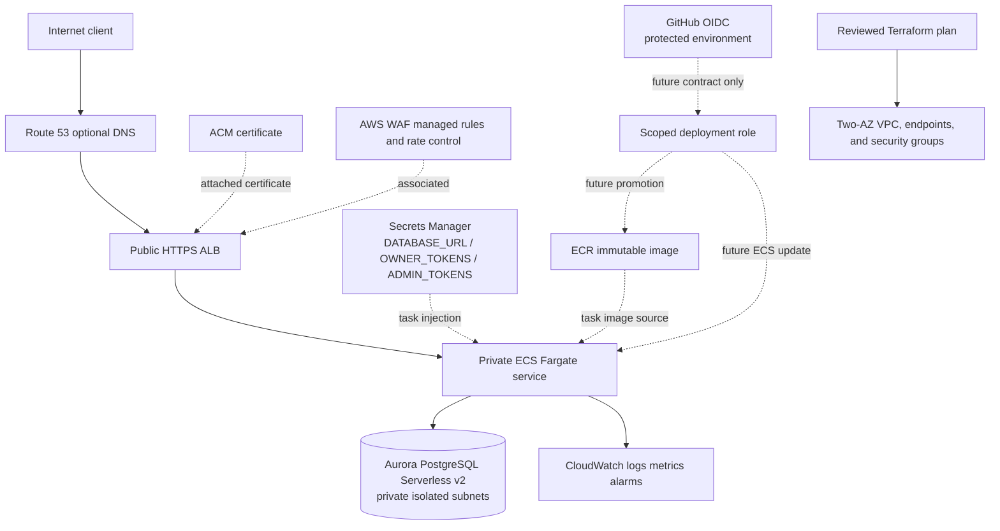

# AWS target topology

Status: Terraform formatting/structural/provider validation and multi-platform
image compatibility were verified in hosted run `31580237125`; cloud behavior
is not verified or deployed.

The non-applied Terraform target makes the ALB the only public application
entry point, keeps ECS and Aurora private, and protects database/KMS deletion
behind explicit lifecycle controls. Route 53 records are intentionally outside
this Terraform root. A deployment also requires an ACM certificate, the three
Secrets Manager task keys shown above, `/healthz` target checks, and an
environment-only OIDC trust. Those target contracts are statically checked but
not cloud verified; the hosted CI image and Linux validation evidence is already
retained in run `31580237125`.
