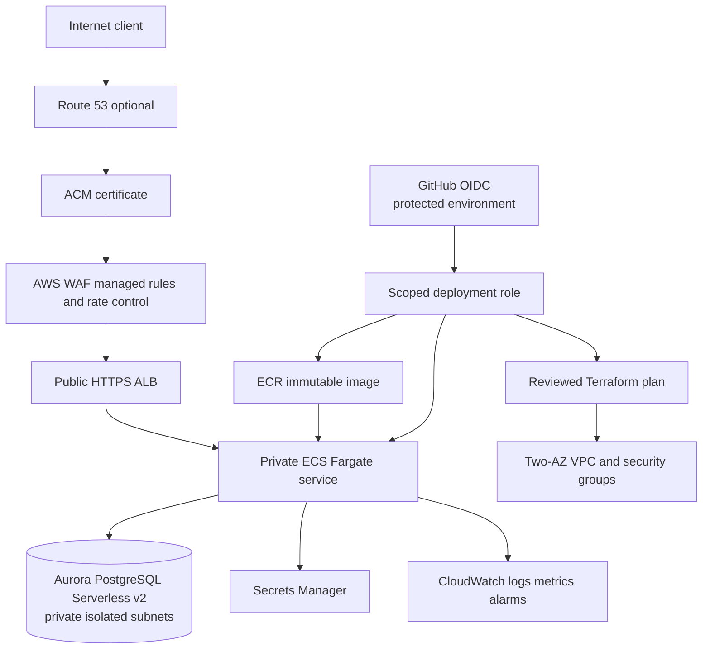

# AWS target topology

Status: Terraform formatting/structural checks locally verified; provider
validation and cloud behavior are not yet verified or deployed.

The non-applied Terraform target makes the ALB the only public application
entry point, keeps ECS and Aurora private, and protects database/KMS deletion
behind explicit lifecycle controls. A deployment also requires an ACM
certificate, application-compatible Secrets Manager environment wiring,
`/healthz` target checks, and an environment-only OIDC trust. Those target
contracts are statically checked but not cloud verified. The image pin must
also be compatible with the CI build platform.
