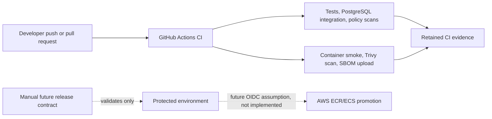

# Delivery and identity boundaries

Status: hosted CI is verified by run `31584503885`; AWS deployment remains
unimplemented and has not been performed.

The current CI workflow does not request AWS OIDC credentials, push to ECR, or
update ECS. The dispatchable release workflow is contract-only: it validates an
immutable image digest and protected environment variables. The target design
separates application task, ECS execution, and future deployment identities; the
service does not issue bearer tokens and validates identity supplied by an
external or local fixture issuer.
