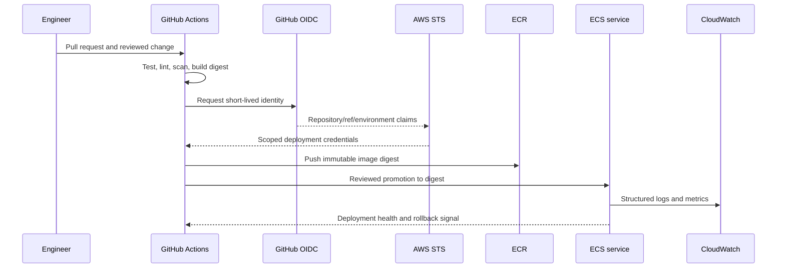

# Delivery and identity boundaries

Status: design evidence only; no cloud deployment has been performed.

The application task role, ECS execution role, deployment role, and read-only
review role are separate target identities. The service does not issue bearer
tokens; it validates identity supplied by an external or local fixture issuer.
