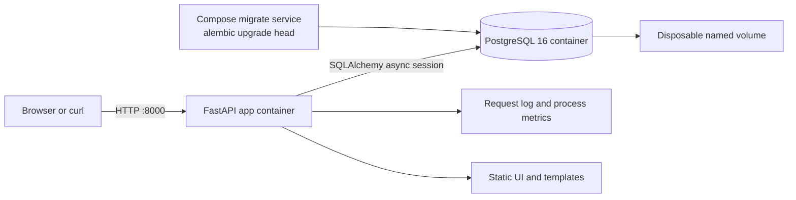

# Local topology

Status: locally verified as a Compose design; end-to-end execution evidence is
recorded separately.

The local database values are deterministic demo values only. The application
container runs as a non-root user; cloud credentials are not required.
